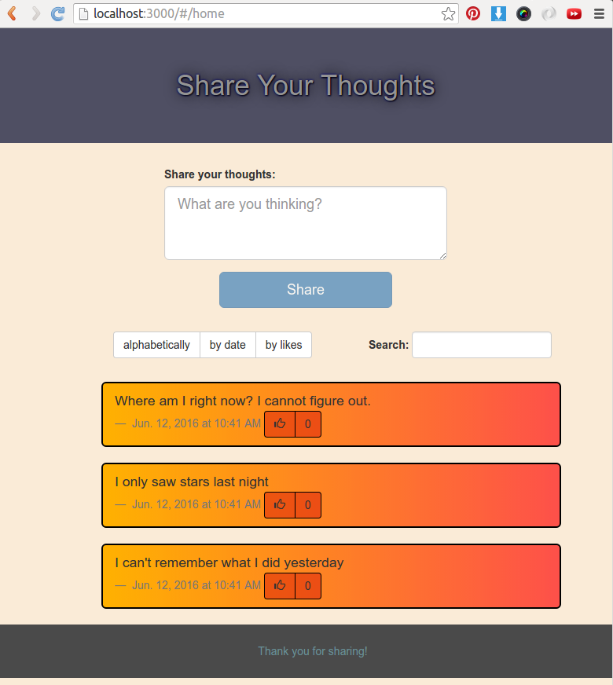

# angular-thundertalk-demo

A demo of a single-page application using AngularJS and a Rails backend.



## Team

* [David Tao](https://github.com/taodav)
* [Renan Martins](https://github.com/nbkhope)

## Live demo on Heroku

http://share-your-thoughts.herokuapp.com

## Presentation Slides

https://prezi.com/y26anp9tpeo1/untitled-prezi/

## Installation

Run bundle to install all dependencies:

```
bundle install
```

Create, migrate, and seed the database:

```
bin/rake db:create db:migrate db:seed
```

Run the Rails server:

```
bin/rails s
```

The application will be available at [http://localhost:3000]
